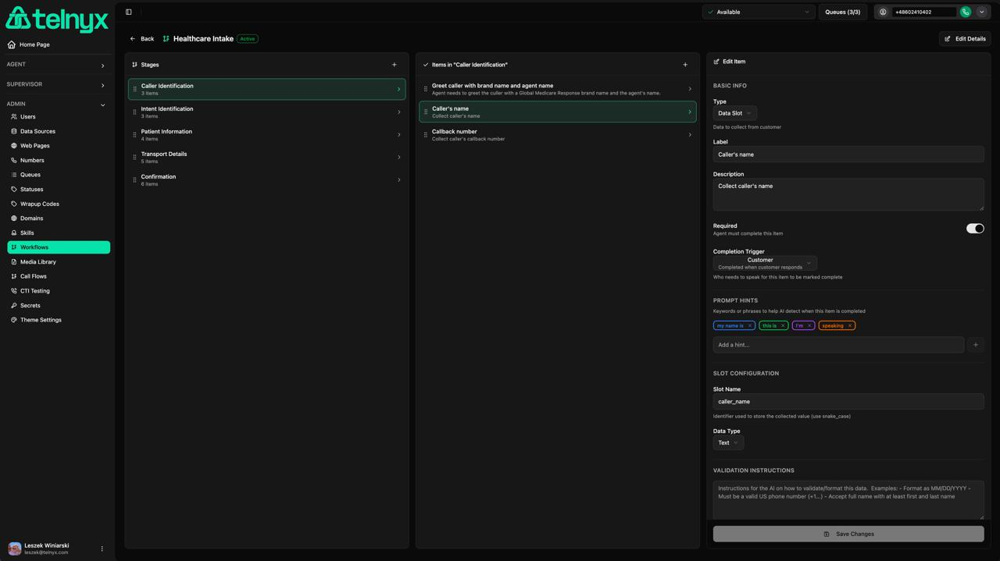
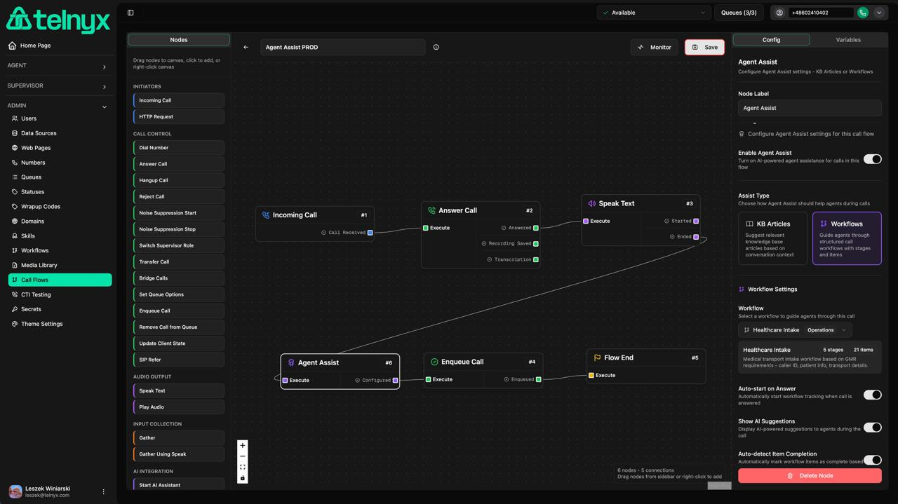
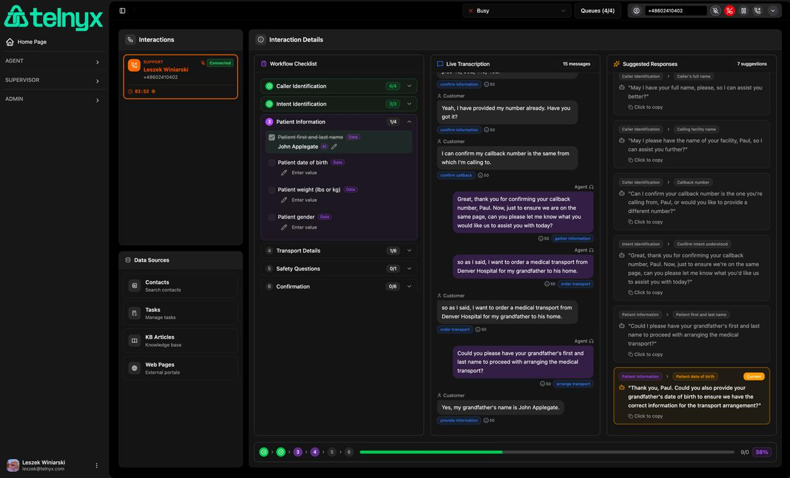
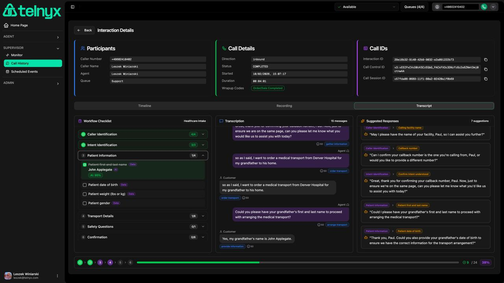

<div align="center">


# Agent Assist Workflows

## User Guide & Configuration Manual

**Telnyx Contact Center**

*Version 1.0 | February 2026*

</div>

---

## Table of Contents

1. [Introduction](#introduction)
2. [Overview](#overview)
3. [Configuring Workflows](#configuring-workflows)
   - [Creating a New Workflow](#creating-a-new-workflow)
   - [Defining Stages](#defining-stages)
   - [Adding Items to Stages](#adding-items-to-stages)
   - [Item Types](#item-types)
   - [Completion Triggers](#completion-triggers)
   - [LLM Model Selection](#llm-model-selection)
4. [Integrating with Call Flows](#integrating-with-call-flows)
   - [Agent Assist Node](#agent-assist-node)
   - [Workflow Mode Configuration](#workflow-mode-configuration)
5. [Agent Desktop Experience](#agent-desktop-experience)
   - [Workflow Checklist Panel](#workflow-checklist-panel)
   - [Live Transcription Panel](#live-transcription-panel)
   - [Suggested Responses Panel](#suggested-responses-panel)
   - [Progress Tracking](#progress-tracking)
6. [Supervisor Call History](#supervisor-call-history)
   - [Transcript Tab](#transcript-tab)
   - [Reviewing Completed Workflows](#reviewing-completed-workflows)
7. [Best Practices](#best-practices)
8. [Troubleshooting](#troubleshooting)

<div class="page-break"></div>

## Introduction

Agent Assist Workflows is a powerful feature in Telnyx Contact Center that guides agents through structured call interactions using AI-powered assistance. This system combines real-time speech-to-text transcription with intelligent workflow automation to help agents deliver consistent, high-quality customer service.

### Key Benefits

- **Consistent Call Handling**: Ensure every agent follows the same structured process
- **Real-time AI Assistance**: Get intelligent suggestions based on conversation context
- **Automatic Data Capture**: Extract customer information from natural conversation
- **Quality Assurance**: Track call completeness and agent compliance
- **Reduced Training Time**: New agents can handle complex calls with guided assistance

---

## Overview

The Agent Assist Workflows system consists of four main components:

1. **Workflow Definitions**: Structured templates that define the stages and items agents must complete
2. **Call Flow Integration**: Connect workflows to your inbound call routing via the Agent Assist node
3. **Agent Desktop Interface**: Three-panel view with checklist, transcription, and suggestions
4. **Supervisor Analytics**: Review completed workflows and transcription history

### Architecture

```
┌─────────────────┐     ┌──────────────────┐     ┌─────────────────┐
│  Call Flow      │────▶│  Agent Assist    │────▶│  Agent Desktop  │
│  (IVR/Routing)  │     │  Node            │     │  (Workflow UI)  │
└─────────────────┘     └──────────────────┘     └─────────────────┘
                               │
                               ▼
                        ┌──────────────────┐
                        │  LLM Analysis    │
                        │  (GPT-4o, etc.)  │
                        └──────────────────┘
```

---

## Configuring Workflows

### Creating a New Workflow

1. Navigate to **Admin** → **Workflows** in the sidebar
2. Click the **New Workflow** button
3. Fill in the workflow details:
   - **Name**: A descriptive name (e.g., "Healthcare Intake", "Sales Qualification")
   - **Description**: Explain the purpose of this workflow
   - **Category**: Group workflows by type (e.g., "Support", "Sales", "Operations")
   - **LLM Model**: Select the AI model for analysis and suggestions
   - **Active**: Enable to make the workflow available for use

### Defining Stages

Stages represent the major phases of a call. Each stage contains items that agents must complete.

**Example stages for a Healthcare Intake workflow:**
1. Caller Identification
2. Intent Identification
3. Patient Information
4. Transport Details
5. Safety Questions
6. Confirmation

To add a stage:
1. Click **Add Stage** in the workflow editor
2. Enter the stage name and description
3. Set whether the stage is required
4. Drag stages to reorder as needed

### Adding Items to Stages

Each stage contains items that represent specific tasks, questions, or data to collect.



To add an item:
1. Expand a stage in the workflow editor
2. Click **Add Item**
3. Configure the item properties:
   - **Label**: What the agent needs to do (e.g., "Greet caller with our brand name")
   - **Description**: Detailed instructions for the agent
   - **Type**: Action, Question, Topic, or Slot (Data)
   - **Completion Trigger**: Who completes this item (Agent or Customer)
   - **Required**: Whether this item must be completed

#### Item Configuration Panel

The right panel shows detailed configuration options:

- **Basic Info**: Type, Label, Description, Required toggle
- **Completion Trigger**: Agent, Customer, or Either
- **Prompt Hints**: Keywords to help AI detect completion (e.g., "my name is", "this is", "I'm", "speaking")
- **Slot Configuration** (for Data items):
  - **Slot Name**: Variable name for storing the value (e.g., `caller_name`)
  - **Data Type**: Text, Number, Date, Select, etc.
- **Validation Instructions**: LLM instructions for formatting (e.g., "Format as MM/DD/YYYY")

### Item Types

| Type | Purpose | Example |
|------|---------|---------|
| **Action** | Tasks the agent performs | "Greet caller with brand name" |
| **Question** | Questions to ask the customer | "Verify account number" |
| **Topic** | Discussion points to cover | "Explain service options" |
| **Slot (Data)** | Information to collect from customer | "Caller's full name", "Callback number" |

### Completion Triggers

The **Completion Trigger** setting determines when an item is marked as complete:

| Trigger | Behavior |
|---------|----------|
| **Agent** | Completed when the agent performs the action (e.g., greeting) |
| **Customer** | Completed when the customer provides the information (e.g., name, account number) |
| **Either** | Completed when either party addresses the item |

**Important**: For **Slot** items that collect customer data, set the trigger to **Customer**. This ensures the item is only marked complete when the customer actually provides the information, not just when the agent asks for it.

### LLM Model Selection

Each workflow can use a different AI model for analysis and suggestion generation. Available models include:

- **OpenAI GPT-4o** (Recommended) - Best balance of speed and intelligence
- **OpenAI GPT-4o-mini** - Faster, more economical
- **Anthropic Claude** models - Alternative providers
- **Google Gemini** models - High context length
- **Open source models** - Llama, Mistral, etc.

Select the model in the workflow edit dialog. Premium models (OpenAI, Anthropic, Google) generally provide better suggestions.

---

## Integrating with Call Flows

### Agent Assist Node

To enable Agent Assist Workflows for incoming calls, add the **Agent Assist** node to your Call Flow.



1. Open the **Call Flow Editor** (Admin → Call Flows)
2. Add an **Agent Assist** node to your flow (typically after Answer Call and before Enqueue Call)
3. Configure the node settings in the right panel:
   - **Enable Agent Assist**: Toggle on to activate
   - **Assist Type**: Select "Workflows" (instead of "KB Articles")
   - **Workflow**: Choose the workflow from the dropdown (e.g., "Healthcare Intake")

### Workflow Mode Configuration

The configuration panel shows:

- **Workflow Selection**: Dropdown with all available workflows
- **Workflow Details**: Shows stages count and items count (e.g., "5 stages, 21 items")
- **Auto-start on Answer**: Automatically begin workflow tracking when call connects
- **Show AI Suggestions**: Display AI-powered suggestions to agents during the call
- **Auto-detect Item Completion**: Automatically mark workflow items as complete based on conversation analysis

```
Agent Assist Node Configuration
├── Enable Agent Assist: ON
├── Assist Type: Workflows
├── Workflow: Healthcare Intake (Operations)
│   └── 5 stages • 21 items
├── Auto-start on Answer: ON
├── Show AI Suggestions: ON
└── Auto-detect Item Completion: ON
```

---

## Agent Desktop Experience

When an agent receives a call with an active workflow, the Agent Desktop displays a three-panel workflow interface:



### Workflow Checklist Panel (Left)

The checklist panel shows all stages and items in the workflow:

- **Green checkmarks** ✓ indicate completed items
- **Orange indicators** show items in progress
- **Gray items** are pending
- **AI badge** appears when items are auto-completed by AI analysis
- **Confidence percentage** shows how certain the AI is about auto-completions

**Manual completion**: Click on any item to manually mark it complete or enter values for data slots.

### Live Transcription Panel (Center)

Real-time conversation transcript with:

- **Customer messages** (left-aligned, dark background)
- **Agent messages** (right-aligned, purple background)
- **Intent badges** showing detected customer intents
- **Sentiment indicators** (positive/neutral/negative)
- **Confidence scores** for AI detections

The transcription is analyzed in real-time to automatically:
- Detect when items are completed
- Extract data for slot items
- Identify customer intent and sentiment

### Suggested Responses Panel (Right)

AI-generated scripts the agent can use:

- Suggestions appear as the workflow progresses
- **Click to copy** any suggestion to clipboard
- Suggestions are contextual, based on:
  - Current workflow item
  - Conversation history
  - Agent name (auto-inserted)
  - Brand/company name

**Example suggestions:**
- "Thank you for calling Global Medical Response. This is Leszek, how may I assist you today?"
- "May I have your full name, please, so I can better assist you?"
- "Could you please provide your callback number?"

### Progress Tracking

The bottom progress bar shows:

- **Stage indicators** (1-6) showing completion status
- **Green progress bar** for overall completion percentage
- **Item counts** (e.g., "9/24 items completed")
- **Percentage badge** (e.g., "38%")

---

## Supervisor Call History

### Transcript Tab

Supervisors can review completed workflows in the Call History section:



1. Navigate to **Supervisor** → **Call History**
2. Select a completed interaction
3. Click the **Transcript** tab

The Transcript tab displays the same three-panel view as the agent desktop, but in read-only mode for review purposes.

#### Interaction Details Header

At the top, you can see:
- **Participants**: Caller number, caller name, agent, queue
- **Call Details**: Direction, status, start time, duration, wrapup codes
- **Call IDs**: Interaction ID, Call Control ID, Call Session ID (for debugging)

### Reviewing Completed Workflows

In the history view, supervisors can:

- **Review all stages and items** with completion status
- **See extracted data values** (e.g., customer names, account numbers)
- **Read the full conversation transcript**
- **View all AI-generated suggestions** that were offered
- **Verify compliance** with workflow requirements
- **Identify training opportunities** from incomplete items

---

## Best Practices

### Workflow Design

1. **Keep stages focused**: Each stage should have a clear purpose
2. **Order items logically**: Follow the natural conversation flow
3. **Write clear descriptions**: Help agents understand what's expected
4. **Use appropriate item types**: Choose the right type for each task
5. **Set correct completion triggers**: Use "Customer" for data collection items

### Writing Good Item Labels

**Good examples:**
- "Greet caller with brand name and your name"
- "Verify caller's identity using account number"
- "Collect patient's full name"

**Avoid:**
- "Greeting" (too vague)
- "Ask for name" (unclear whose name)

### LLM Prompt Hints

For each item, you can add prompt hints to help the AI better detect completion:

- **Keywords**: Words that indicate the item is addressed
- **Phrases**: Common ways the item might be completed
- **Patterns**: Data formats to look for (e.g., phone numbers, dates)

---

## Troubleshooting

### Common Issues

| Issue | Solution |
|-------|----------|
| Items not auto-completing | Check completion trigger setting. For data collection, use "Customer" trigger |
| Wrong data extracted | Add more specific prompt hints to the item |
| Suggestions showing [Your Name] | Ensure agent has first/last name in their user profile |
| No transcription showing | Verify transcription is enabled in Agent Assist node |
| Workflow not appearing | Check that workflow is set to "Active" |

### Logs and Debugging

Check browser console for detailed logs:
- `[AgentAssistWorkflow]` - Workflow state changes
- `[generateSuggestion]` - Suggestion generation
- `[analyzeTranscript]` - Transcript analysis

---

## Support

For additional support:
- **Documentation**: [developers.telnyx.com](https://developers.telnyx.com)
- **Support Portal**: [support.telnyx.com](https://support.telnyx.com)

---

*© 2026 Telnyx. All rights reserved.*
